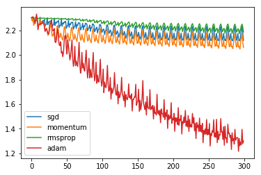
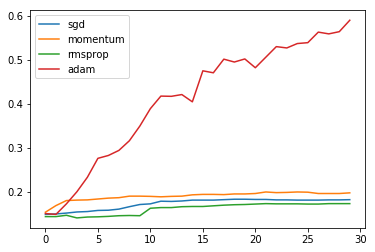
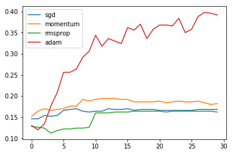

# ECBM E4040 Assignment 2 - Task 1: Optimization

In this task, we introduce multiple SGD-based optimization methods. As you have learned from the last assignment, SGD is an efficient method to update parameters. However, to make SGD perform well, we need to find an appropriate learning rate and a good initial value. Otherwise, the network will get stuck if learning rate is small, or it will diverge if the learning rate is too large. In reality, since we have no prior knowledge about the training data, it is not trivial to find a good learning rate manually. Also, when the network becomes deeper, for each layer we may need to set a different learning rate, and that will again increase the development workload. Obviously, this is not a good direction. 

Another common problem is the lack of sufficient training data. This can make our training get stuck when using the naive SGD method. 

So, **how to set a good learning rate?** You are going to experiment with **SGD with momentum**, **RMSProp**, **Adam** and make comparisons.

All of these optimizers are adaptive learning rate methods. Here is a useful link: http://ruder.io/optimizing-gradient-descent/.


```python
% matplotlib inline
% load_ext autoreload
% autoreload 2

# Import modules
from __future__ import print_function
import tensorflow as tf
import numpy as np
import matplotlib.pyplot as plt
from ecbm4040.cifar_utils import load_data
```

## Load CIFAR 10

Here we use a small dataset with only 2500 samples to simulate "lack-of-data" situation.


```python
# Load the raw CIFAR-10 data.
X_train, y_train, X_test, y_test = load_data()
X_val = X_train[:500,:]
y_val = y_train[:500]
X_train = X_train[500:2500,:]
y_train = y_train[500:2500]

mean_image = np.mean(X_train, axis=0).astype(np.float32)
X_train = X_train.astype(np.float32) - mean_image
X_val = X_val.astype(np.float32) - mean_image

# We've vectorized the data for you. That is, we flatten the 32×32×3 images into 1×3072 Numpy arrays.
print('Training data shape: ', X_train.shape)
print('Training labels shape: ', y_train.shape)
print('Validation data shape: ', X_val.shape)
print('Validation labels shape: ', y_val.shape)
```

    Start downloading data...
    Download complete.
    Training data shape:  (2000, 3072)
    Training labels shape:  (2000,)
    Validation data shape:  (500, 3072)
    Validation labels shape:  (500,)


## Part 1: Implement Optimizers

Here we provide an MLP code snippet for testing.


```python
from ecbm4040.neuralnets.mlp import MLP
```

### Original SGD (for comparison purpose only)


```python
from ecbm4040.optimizers import SGDOptim

model = MLP(input_dim=3072, hidden_dims=[100, 100], num_classes=10, weight_scale=1e-3, l2_reg=0.0)
optimizer = SGDOptim()
hist_sgd = optimizer.train(model, X_train, y_train, X_val, y_val, 
                           num_epoch=30, batch_size=200, learning_rate=1e-2, learning_decay=0.95, 
                           verbose=False, record_interval=1)
```

    number of batches for training: 10
    epoch 1: valid acc = 0.146, new learning rate = 0.0095
    epoch 2: valid acc = 0.146, new learning rate = 0.009025
    epoch 3: valid acc = 0.154, new learning rate = 0.00857375
    epoch 4: valid acc = 0.152, new learning rate = 0.0081450625
    epoch 5: valid acc = 0.154, new learning rate = 0.007737809374999999
    epoch 6: valid acc = 0.166, new learning rate = 0.007350918906249998
    epoch 7: valid acc = 0.168, new learning rate = 0.006983372960937498
    epoch 8: valid acc = 0.17, new learning rate = 0.006634204312890623
    epoch 9: valid acc = 0.164, new learning rate = 0.006302494097246091
    epoch 10: valid acc = 0.162, new learning rate = 0.005987369392383786
    epoch 11: valid acc = 0.164, new learning rate = 0.005688000922764597
    epoch 12: valid acc = 0.164, new learning rate = 0.005403600876626367
    epoch 13: valid acc = 0.17, new learning rate = 0.005133420832795048
    epoch 14: valid acc = 0.168, new learning rate = 0.0048767497911552955
    epoch 15: valid acc = 0.168, new learning rate = 0.00463291230159753
    epoch 16: valid acc = 0.17, new learning rate = 0.0044012666865176535
    epoch 17: valid acc = 0.166, new learning rate = 0.004181203352191771
    epoch 18: valid acc = 0.168, new learning rate = 0.003972143184582182
    epoch 19: valid acc = 0.168, new learning rate = 0.0037735360253530726
    epoch 20: valid acc = 0.168, new learning rate = 0.0035848592240854188
    epoch 21: valid acc = 0.166, new learning rate = 0.0034056162628811476
    epoch 22: valid acc = 0.166, new learning rate = 0.0032353354497370902
    epoch 23: valid acc = 0.166, new learning rate = 0.0030735686772502355
    epoch 24: valid acc = 0.166, new learning rate = 0.0029198902433877237
    epoch 25: valid acc = 0.166, new learning rate = 0.0027738957312183374
    epoch 26: valid acc = 0.166, new learning rate = 0.0026352009446574203
    epoch 27: valid acc = 0.168, new learning rate = 0.002503440897424549
    epoch 28: valid acc = 0.168, new learning rate = 0.0023782688525533216
    epoch 29: valid acc = 0.168, new learning rate = 0.0022593554099256553
    epoch 30: valid acc = 0.168, new learning rate = 0.0021463876394293723


### SGD + Momentum

<span style="color:red">__TODO:__</span> Edit **SGDmomentumOptim** in __./ecbm4040/optimizers.py__


```python
from ecbm4040.optimizers import SGDmomentumOptim

model = MLP(input_dim=3072, hidden_dims=[100, 100], num_classes=10, l2_reg=0.0, weight_scale=1e-3)
optimizer = SGDmomentumOptim(model, momentum=0.8)
hist_sgd_momentum = optimizer.train(model, X_train, y_train, X_val, y_val, 
                                         num_epoch=30, batch_size=200, learning_rate=1e-2, 
                                         learning_decay=0.95, verbose=False, record_interval=1)
```

    number of batches for training: 10
    epoch 1: valid acc = 0.152, new learning rate = 0.0095
    epoch 2: valid acc = 0.164, new learning rate = 0.009025
    epoch 3: valid acc = 0.17, new learning rate = 0.00857375
    epoch 4: valid acc = 0.166, new learning rate = 0.0081450625
    epoch 5: valid acc = 0.168, new learning rate = 0.007737809374999999
    epoch 6: valid acc = 0.17, new learning rate = 0.007350918906249998
    epoch 7: valid acc = 0.176, new learning rate = 0.006983372960937498
    epoch 8: valid acc = 0.176, new learning rate = 0.006634204312890623
    epoch 9: valid acc = 0.192, new learning rate = 0.006302494097246091
    epoch 10: valid acc = 0.188, new learning rate = 0.005987369392383786
    epoch 11: valid acc = 0.192, new learning rate = 0.005688000922764597
    epoch 12: valid acc = 0.194, new learning rate = 0.005403600876626367
    epoch 13: valid acc = 0.194, new learning rate = 0.005133420832795048
    epoch 14: valid acc = 0.194, new learning rate = 0.0048767497911552955
    epoch 15: valid acc = 0.192, new learning rate = 0.00463291230159753
    epoch 16: valid acc = 0.192, new learning rate = 0.0044012666865176535
    epoch 17: valid acc = 0.186, new learning rate = 0.004181203352191771
    epoch 18: valid acc = 0.186, new learning rate = 0.003972143184582182
    epoch 19: valid acc = 0.186, new learning rate = 0.0037735360253530726
    epoch 20: valid acc = 0.186, new learning rate = 0.0035848592240854188
    epoch 21: valid acc = 0.188, new learning rate = 0.0034056162628811476
    epoch 22: valid acc = 0.184, new learning rate = 0.0032353354497370902
    epoch 23: valid acc = 0.186, new learning rate = 0.0030735686772502355
    epoch 24: valid acc = 0.188, new learning rate = 0.0029198902433877237
    epoch 25: valid acc = 0.186, new learning rate = 0.0027738957312183374
    epoch 26: valid acc = 0.186, new learning rate = 0.0026352009446574203
    epoch 27: valid acc = 0.188, new learning rate = 0.002503440897424549
    epoch 28: valid acc = 0.184, new learning rate = 0.0023782688525533216
    epoch 29: valid acc = 0.18, new learning rate = 0.0022593554099256553
    epoch 30: valid acc = 0.182, new learning rate = 0.0021463876394293723


### RMSprop

<span style="color:red">__TODO:__</span> Edit **RMSpropOptim** in **./ecbm4040/optimizers.py**


```python
from ecbm4040.optimizers import RMSpropOptim

model = MLP(input_dim=3072, hidden_dims=[100, 100], num_classes=10, l2_reg=0.0, weight_scale=1e-3)
optimizer = RMSpropOptim(model)
hist_rmsprop = optimizer.train(model, X_train, y_train, X_val, y_val, 
                               num_epoch=30, batch_size=200, learning_rate=1e-5, 
                               learning_decay=0.95, verbose=False, record_interval=1)
```

    number of batches for training: 10
    epoch 1: valid acc = 0.128, new learning rate = 9.5e-06
    epoch 2: valid acc = 0.126, new learning rate = 9.025e-06
    epoch 3: valid acc = 0.124, new learning rate = 8.57375e-06
    epoch 4: valid acc = 0.112, new learning rate = 8.1450625e-06
    epoch 5: valid acc = 0.118, new learning rate = 7.737809375e-06
    epoch 6: valid acc = 0.122, new learning rate = 7.35091890625e-06
    epoch 7: valid acc = 0.122, new learning rate = 6.9833729609374995e-06
    epoch 8: valid acc = 0.124, new learning rate = 6.634204312890624e-06
    epoch 9: valid acc = 0.124, new learning rate = 6.302494097246093e-06
    epoch 10: valid acc = 0.126, new learning rate = 5.9873693923837885e-06
    epoch 11: valid acc = 0.16, new learning rate = 5.688000922764599e-06
    epoch 12: valid acc = 0.16, new learning rate = 5.403600876626369e-06
    epoch 13: valid acc = 0.16, new learning rate = 5.13342083279505e-06
    epoch 14: valid acc = 0.162, new learning rate = 4.876749791155297e-06
    epoch 15: valid acc = 0.162, new learning rate = 4.6329123015975315e-06
    epoch 16: valid acc = 0.162, new learning rate = 4.401266686517655e-06
    epoch 17: valid acc = 0.164, new learning rate = 4.181203352191772e-06
    epoch 18: valid acc = 0.164, new learning rate = 3.972143184582183e-06
    epoch 19: valid acc = 0.164, new learning rate = 3.773536025353074e-06
    epoch 20: valid acc = 0.164, new learning rate = 3.58485922408542e-06
    epoch 21: valid acc = 0.164, new learning rate = 3.405616262881149e-06
    epoch 22: valid acc = 0.162, new learning rate = 3.2353354497370914e-06
    epoch 23: valid acc = 0.164, new learning rate = 3.0735686772502367e-06
    epoch 24: valid acc = 0.164, new learning rate = 2.9198902433877247e-06
    epoch 25: valid acc = 0.164, new learning rate = 2.7738957312183385e-06
    epoch 26: valid acc = 0.164, new learning rate = 2.6352009446574215e-06
    epoch 27: valid acc = 0.164, new learning rate = 2.5034408974245503e-06
    epoch 28: valid acc = 0.164, new learning rate = 2.378268852553323e-06
    epoch 29: valid acc = 0.164, new learning rate = 2.2593554099256565e-06
    epoch 30: valid acc = 0.162, new learning rate = 2.1463876394293738e-06


### Adam

<span style="color:red">__TODO:__</span> Edit **AdamOptim** in **./ecbm4040/optimizers.py**


```python
from ecbm4040.optimizers import AdamOptim

model = MLP(input_dim=3072, hidden_dims=[100, 100], num_classes=10, l2_reg=0.0, weight_scale=1e-3)
optimizer = AdamOptim(model)
hist_adam = optimizer.train(model, X_train, y_train, X_val, y_val, 
                            num_epoch=30, batch_size=200, learning_rate=1e-3, 
                            learning_decay=0.95, verbose=False, record_interval=1)
```

    number of batches for training: 10
    epoch 1: valid acc = 0.13, new learning rate = 0.00095
    epoch 2: valid acc = 0.12, new learning rate = 0.0009025
    epoch 3: valid acc = 0.134, new learning rate = 0.000857375
    epoch 4: valid acc = 0.176, new learning rate = 0.0008145062499999999
    epoch 5: valid acc = 0.208, new learning rate = 0.0007737809374999998
    epoch 6: valid acc = 0.256, new learning rate = 0.0007350918906249997
    epoch 7: valid acc = 0.256, new learning rate = 0.0006983372960937497
    epoch 8: valid acc = 0.264, new learning rate = 0.0006634204312890621
    epoch 9: valid acc = 0.292, new learning rate = 0.000630249409724609
    epoch 10: valid acc = 0.306, new learning rate = 0.0005987369392383785
    epoch 11: valid acc = 0.344, new learning rate = 0.0005688000922764595
    epoch 12: valid acc = 0.318, new learning rate = 0.0005403600876626365
    epoch 13: valid acc = 0.336, new learning rate = 0.0005133420832795047
    epoch 14: valid acc = 0.33, new learning rate = 0.00048767497911552944
    epoch 15: valid acc = 0.324, new learning rate = 0.00046329123015975297
    epoch 16: valid acc = 0.362, new learning rate = 0.0004401266686517653
    epoch 17: valid acc = 0.356, new learning rate = 0.00041812033521917703
    epoch 18: valid acc = 0.37, new learning rate = 0.00039721431845821814
    epoch 19: valid acc = 0.336, new learning rate = 0.0003773536025353072
    epoch 20: valid acc = 0.358, new learning rate = 0.0003584859224085418
    epoch 21: valid acc = 0.368, new learning rate = 0.0003405616262881147
    epoch 22: valid acc = 0.368, new learning rate = 0.00032353354497370894
    epoch 23: valid acc = 0.366, new learning rate = 0.00030735686772502346
    epoch 24: valid acc = 0.384, new learning rate = 0.00029198902433877225
    epoch 25: valid acc = 0.35, new learning rate = 0.00027738957312183364
    epoch 26: valid acc = 0.358, new learning rate = 0.0002635200944657419
    epoch 27: valid acc = 0.388, new learning rate = 0.0002503440897424548
    epoch 28: valid acc = 0.398, new learning rate = 0.00023782688525533205
    epoch 29: valid acc = 0.396, new learning rate = 0.00022593554099256544
    epoch 30: valid acc = 0.392, new learning rate = 0.00021463876394293716


## Part 2: Comparison

<span style="color:red">__TODO:__</span> Run the following cells, which plot the loss curves of different optimizers. 


```python
loss_hist_sgd, train_acc_hist_sgd, val_acc_hist_sgd = hist_sgd
loss_hist_momentum, train_acc_hist_momentum, val_acc_hist_momentum = hist_sgd_momentum
loss_hist_rmsprop, train_acc_hist_rmsprop, val_acc_hist_rmsprop = hist_rmsprop
loss_hist_adam, train_acc_hist_adam, val_acc_hist_adam = hist_adam
```


```python
# Plot training error curve of optimizers
plt.plot(loss_hist_sgd, label="sgd")
plt.plot(loss_hist_momentum, label="momentum")
plt.plot(loss_hist_rmsprop, label="rmsprop")
plt.plot(loss_hist_adam, label="adam")
plt.legend()
plt.show()
```





```python
# Plot training accuracy curve of optimizers
plt.plot(train_acc_hist_sgd, label="sgd")
plt.plot(train_acc_hist_momentum, label="momentum")
plt.plot(train_acc_hist_rmsprop, label="rmsprop")
plt.plot(train_acc_hist_adam, label="adam")
plt.legend()
plt.show()
```





```python
# Plot validation accuracy curve of optimizers
plt.plot(val_acc_hist_sgd, label="sgd")
plt.plot(val_acc_hist_momentum, label="momentum")
plt.plot(val_acc_hist_rmsprop, label="rmsprop")
plt.plot(val_acc_hist_adam, label="adam")
plt.legend()
plt.show()
```





<span style="color:red">__TODO:__</span> Describe your results, and discuss your understandings of these optimizers, such as their advantages/disadvantages and when to use them.

Answer: Adam has the best performance among all in this experiment. Does it mean Adam is better than the others? No. Adam makes it easy to converge quickly on the first try, finding a sharp local minima. SGD tends to converge to flat local minima. With momentum, this issue can be greatly resolved and we can get a much faster convergence. In reality, SGD momentum is often used as the state of the art optimizer but its parameters require more tunning.
